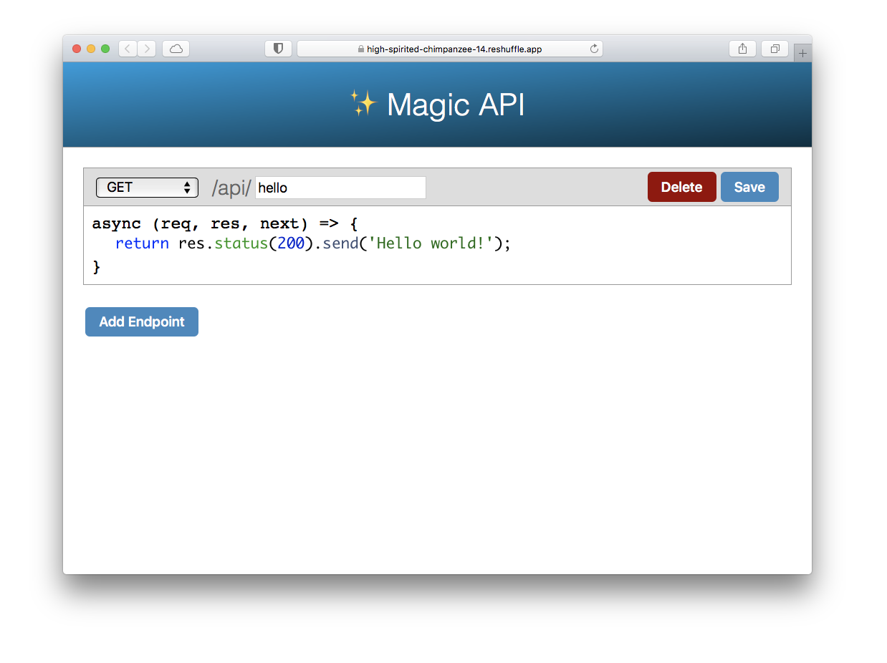

This is a [Reshuffle](https://reshuffle.com/) template.

Counter is our very basic template. It displays a single number on screen
and lets users increase that by hitting the "+1" button. Data is stored
in a cloud backend, so the counter value persists even when the page is
reloaded.

This template is implemented using React Hooks. A class based versions is
also available.

Keywords: counter, react-hooks, tutorial

## Screenshots:

